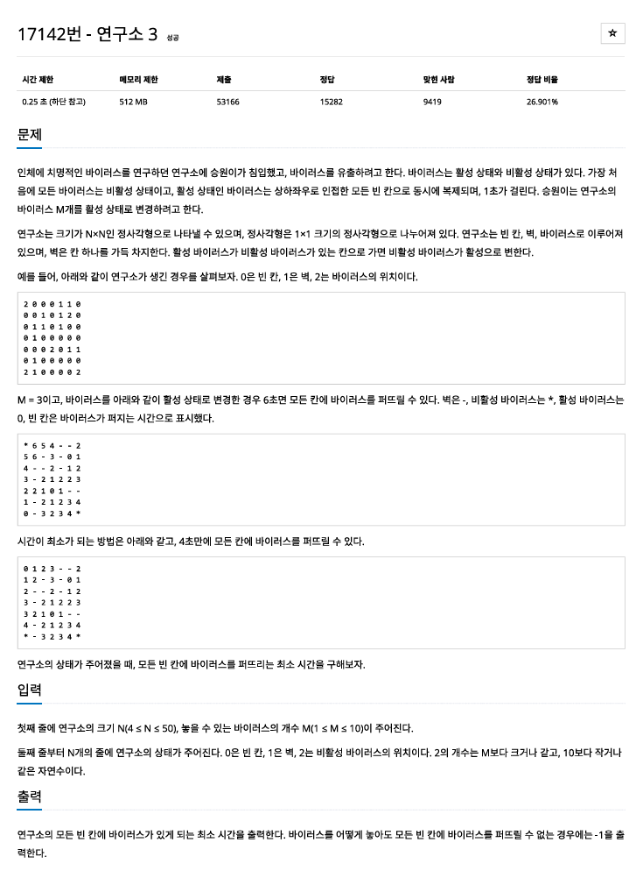

# 알고리즘



지난주 연구소 + 치킨배달 문제라고 생각하면됨

빈칸과 바이러스의 정보를 입력 받을 때 저장해두고

```java
map = new int[N][N];
		for (int i = 0; i < N; i++) {
			st = new StringTokenizer(br.readLine());
			for (int j = 0; j < N; j++) {
				map[i][j] = Integer.parseInt(st.nextToken());
				if (map[i][j] == 2)
					virus.add(new int[] { i, j });
				else if (map[i][j] == 0)
					blank.add(new int[] { i, j });
			}
		}
```

M개의 바이러스 조합에 대해 bfs수행하기

```java
// 조합
	static void comb(int idx, int start, int[] pick) {
		if (idx == M) {
			ans = Math.min(ans, bfs(pick));
			return;
		}
		for (int i = start; i < virus.size(); i++) {
			pick[idx] = i;
			comb(idx + 1, i + 1, pick);
		}
	}
```

 bfs할때는 적절한 가지치기와 시간기록 로직이 필요함

```java
// 조기종료
// 현재 시각이 이미 최적값 이상이면 더 탐색할 필요 없음
			if (t >= ans)
				return Integer.MAX_VALUE;

```

```java
// 시간기록
if (map[nr][nc] == 0) { // 빈칸 처음 도달
		filled++;
		lastTime = nt;
		if (filled == blank.size())
			return lastTime; // 모두 채웠으면 종료
	}
```

```java
import java.io.BufferedReader;
import java.io.IOException;
import java.io.InputStreamReader;
import java.util.ArrayList;
import java.util.LinkedList;
import java.util.List;
import java.util.Queue;
import java.util.StringTokenizer;

public class Main {
	static int N, M;
	static int[][] map;
	static List<int[]> virus = new ArrayList<>(), blank = new ArrayList<>();
	static int ans = Integer.MAX_VALUE;
	static int[] dr = { -1, 0, 1, 0 };
	static int[] dc = { 0, -1, 0, 1 };

	public static void main(String[] args) throws IOException {
		BufferedReader br = new BufferedReader(new InputStreamReader(System.in));
		StringTokenizer st = new StringTokenizer(br.readLine());

		N = Integer.parseInt(st.nextToken());
		M = Integer.parseInt(st.nextToken());

		map = new int[N][N];
		for (int i = 0; i < N; i++) {
			st = new StringTokenizer(br.readLine());
			for (int j = 0; j < N; j++) {
				map[i][j] = Integer.parseInt(st.nextToken());
				if (map[i][j] == 2)
					virus.add(new int[] { i, j });
				else if (map[i][j] == 0)
					blank.add(new int[] { i, j });
			}
		}

		// 빈칸 없으면 0
		if (blank.isEmpty()) {
			System.out.println(0);
			return;
		}

		// 바이러스 M개 조합
		int[] pick = new int[M];
		comb(0, 0, pick);

        if(ans == Integer.MAX_VALUE)
            ans = -1;
        System.out.println(ans);
	}

	// 조합
	static void comb(int idx, int start, int[] pick) {
		if (idx == M) {
			ans = Math.min(ans, bfs(pick));
			return;
		}
		for (int i = start; i < virus.size(); i++) {
			pick[idx] = i;
			comb(idx + 1, i + 1, pick);
		}
	}

	// bfs
	static int bfs(int[] pick) {
		boolean[][] visited = new boolean[N][N];
		Queue<int[]> q = new LinkedList<>();

		for (int idx : pick) {
			int[] v = virus.get(idx);
			visited[v[0]][v[1]] = true;
			q.offer(new int[] { v[0], v[1], 0 });
		}

		int filled = 0; // 채운 빈칸 수
		int lastTime = 0; // 마지막으로 빈칸 도달 시간

		while (!q.isEmpty()) {
			int[] cur = q.poll();
			int r = cur[0], c = cur[1], t = cur[2];

			// 현재 시각이 이미 최적값 이상이면 더 탐색할 필요 없음
			if (t >= ans)
				return Integer.MAX_VALUE;

			for (int d = 0; d < 4; d++) {
				int nr = r + dr[d], nc = c + dc[d];
				if (nr < 0 || nr >= N || nc < 0 || nc >= N)
					continue;
				if (map[nr][nc] == 1)
					continue; // 벽
				if (visited[nr][nc])
					continue;

				visited[nr][nc] = true;
				int nt = t+1;
				
				if (map[nr][nc] == 0) { // 빈칸 처음 도달
					filled++;
					lastTime = nt;
					if (filled == blank.size())
						return lastTime; // 모두 채웠으면 종료
				}
				q.offer(new int[] { nr, nc, nt }); // 0/2 모두 진행
			}
		}

		// 못 채우면 실패
		return Integer.MAX_VALUE;
	}
}
```